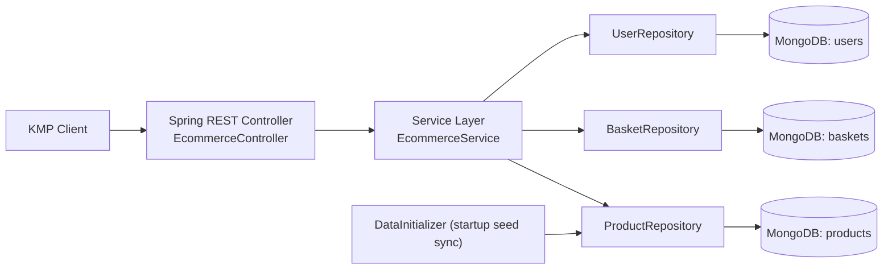

# Backend Technical Audit: AREcommerceApi

Audit date: 2026-02-08
Scope: full repository `/Users/glebporosin/IdeaProjects/AREcommerceApi`

## Executive summary (ключевые риски/выигрыши)

### Ключевые риски
- **Critical:** отсутствуют AuthN/AuthZ проверки на всех API, сервис публично изменяет корзины по произвольному `userId`.
- **High:** бизнес-данные `products` пересинхронизируются и очищаются на каждом старте приложения, что создает риск потери продовых данных.
- **High:** отсутствуют уникальные/поисковые индексы (`sku`, `userId`), что дает риск дублей, гонок и деградации производительности.
- **High:** нет стандартного error contract и валидации входа; часть ошибок возвращается как `500` (например, `quantity <= 0`).
- **High:** observability не внедрена (нет health/readiness/metrics/tracing), CI/CD и supply-chain контроли отсутствуют.

### Ключевые выигрыши
- Минимальный и понятный кодовый контур (controller -> service -> repository) с низким порогом изменений.
- Многослойный Docker build уже есть.
- Конфиг Mongo вынесен в env (`SPRING_DATA_MONGODB_URI`), что удобно для локального/контейнерного запуска.
- Основные бизнес-ручки работают end-to-end в локальном Docker.

## Контекст сервиса (назначение, домен, SLA/SLO если видно)

Сервис обслуживает e-commerce use cases для KMP клиента:
- генерация `userId`
- выдача PLP (`/api/plp`)
- выдача PDP (`/api/pdp/{sku}`)
- запись и чтение корзины (`/api/basket`)

Технологический стек:
- Kotlin + Spring Boot 3.5.7
- MongoDB (single instance)
- Docker Compose для локальной эксплуатации

SLA/SLO:
- в репозитории не обнаружены SLO/SLA, error budget, целевые p95/p99 latency.

## Архитектура и компоненты (схема в mermaid)

Архитектурный стиль: классический layered monolith, без выделенных bounded contexts, без портов/адаптеров.

### Замечание A-ARCH-01
- Severity: Medium
- Impact: ограниченная эволюция доменной модели, сервисный класс становится точкой концентрации логики.
- Evidence: `/Users/glebporosin/IdeaProjects/AREcommerceApi/src/main/kotlin/com/poroshin/rut/ar/api/service/EcommerceService.kt`.
- Fix: выделить use-case сервисы (`UserService`, `CatalogService`, `BasketService`), DTO мапперы, доменные policy-объекты.
- Trade-offs: больше файлов и интерфейсов, выше первоначальные накладные расходы.

## API (REST/GraphQL/gRPC): качество контрактов, версионирование

Реализован только REST; GraphQL/gRPC отсутствуют.

### Замечание A-API-01
- Severity: High
- Impact: отсутствует контроль доступа; любой клиент может читать/изменять данные любой корзины.
- Evidence: `/Users/glebporosin/IdeaProjects/AREcommerceApi/src/main/kotlin/com/poroshin/rut/ar/api/controller/EcommerceController.kt:18` и отсутствуют security annotations/filters.
- Fix: ввести Spring Security (JWT/OAuth2), проверку subject против `userId` на каждой write/read ручке.
- Trade-offs: усложнение клиентской интеграции, необходимость token lifecycle.

### Замечание A-API-02
- Severity: High
- Impact: нестабильный API contract при ошибках; клиенты получают `500` вместо `4xx`.
- Evidence:
  - `require(request.quantity > 0)` в `/Users/glebporosin/IdeaProjects/AREcommerceApi/src/main/kotlin/com/poroshin/rut/ar/api/service/EcommerceService.kt:53`.
  - Runtime проверка: `POST /api/basket` с `quantity=0` -> `500`.
- Fix: `javax.validation` (`@Valid`, `@Min(1)`), `@RestControllerAdvice` с единым error schema.
- Trade-offs: потребуется согласование формата ошибок с клиентом.

### Замечание A-API-03
- Severity: Medium
- Impact: невозможность безопасной эволюции API без breaking changes.
- Evidence: endpoint namespace без версии (`/api/...`) в `/Users/glebporosin/IdeaProjects/AREcommerceApi/src/main/kotlin/com/poroshin/rut/ar/api/controller/EcommerceController.kt`.
- Fix: добавить `v1` namespace (`/api/v1`) и policy compatibility.
- Trade-offs: нужно поддерживать migration window.

### Замечание A-API-04
- Severity: Medium
- Impact: неоднозначная бизнес-семантика: несуществующий товар возвращается как mock `200`, что может маскировать ошибки каталога.
- Evidence: fallback в `/Users/glebporosin/IdeaProjects/AREcommerceApi/src/main/kotlin/com/poroshin/rut/ar/api/service/EcommerceService.kt:46-50` и `:129-159`.
- Fix: переключаемое поведение по профилю: `404` в prod, mock только в `dev/mock` режиме.
- Trade-offs: для демонстраций потребуются profile flags.

### Замечание A-API-05
- Severity: Medium
- Impact: отсутствие пагинации и фильтрации приводит к росту latency и payload с увеличением каталога.
- Evidence: `/api/plp` возвращает полный список, `getPlp()` использует `findAll()` в `/Users/glebporosin/IdeaProjects/AREcommerceApi/src/main/kotlin/com/poroshin/rut/ar/api/service/EcommerceService.kt:39-44`.
- Fix: добавить `page/size/sort/filter` и пагинацию на уровне БД.
- Trade-offs: изменение контракта, клиенту нужна адаптация.

### Замечание A-API-06
- Severity: Low
- Impact: опечатка `arRecourceUrl` затрудняет долгосрочную поддержку контрактов и автогенерацию SDK.
- Evidence: `/Users/glebporosin/IdeaProjects/AREcommerceApi/src/main/kotlin/com/poroshin/rut/ar/api/model/ProductModels.kt:33`.
- Fix: ввести `arResourceUrl` с backward-compatible alias/dual-field на период миграции.
- Trade-offs: временное дублирование полей.

## Данные (БД/кэш/очереди): модели, миграции, транзакции

БД: MongoDB, коллекции `products`, `users`, `baskets`. Кэш/очереди отсутствуют.

### Замечание A-DATA-01
- Severity: High
- Impact: коллекционные scan и риск дублей; `findBySku`/`findByUserId` не гарантируют уникальность.
- Evidence:
  - Репозитории: `/Users/glebporosin/IdeaProjects/AREcommerceApi/src/main/kotlin/com/poroshin/rut/ar/api/repository/ProductRepository.kt:9`, `/Users/glebporosin/IdeaProjects/AREcommerceApi/src/main/kotlin/com/poroshin/rut/ar/api/repository/UserRepository.kt:9`, `/Users/glebporosin/IdeaProjects/AREcommerceApi/src/main/kotlin/com/poroshin/rut/ar/api/repository/BasketRepository.kt:9`.
  - Runtime `getIndexes()` -> только `_id` индекс во всех коллекциях.
- Fix: уникальные индексы: `products.sku`, `users.userId`, `baskets.userId`; доп. индекс по `baskets.items.sku` при необходимости.
- Trade-offs: миграция индексов потребует чистки существующих дублей.

### Замечание A-DATA-02
- Severity: High
- Impact: DataInitializer удаляет любые "лишние" товары при старте; риск потери данных в production.
- Evidence: `/Users/glebporosin/IdeaProjects/AREcommerceApi/src/main/kotlin/com/poroshin/rut/ar/api/config/DataInitializer.kt:122-138`.
- Fix: ограничить сидирование профилем `dev/local`, убрать destructive delete из startup path.
- Trade-offs: понадобится отдельный migration/seed pipeline.

### Замечание A-DATA-03
- Severity: Medium
- Impact: поле `price` как `String` блокирует корректные numeric сортировки, агрегации и валидацию.
- Evidence: `/Users/glebporosin/IdeaProjects/AREcommerceApi/src/main/kotlin/com/poroshin/rut/ar/api/entity/ProductDocument.kt:15` и `/Users/glebporosin/IdeaProjects/AREcommerceApi/src/main/kotlin/com/poroshin/rut/ar/api/model/ProductModels.kt:7,18`.
- Fix: хранить amount в minor units (`Long`) + currency code.
- Trade-offs: миграция схемы и контрактов клиента.

### Замечание A-DATA-04
- Severity: Medium
- Impact: `GET /api/basket` создает пользователя как побочный эффект, что загрязняет `users` и усложняет аудит.
- Evidence:
  - `ensureUserExists(userId)` в `/Users/glebporosin/IdeaProjects/AREcommerceApi/src/main/kotlin/com/poroshin/rut/ar/api/service/EcommerceService.kt:71-76,174-177`.
  - Runtime: `before=0`, `GET /api/basket?userId=audit-get-only-...` -> `after=1`.
- Fix: убрать write-side effect из GET; возвращать пустую корзину без записи пользователя.
- Trade-offs: если логика требовала pre-provision пользователя, нужен отдельный explicit endpoint.

### Замечание A-DATA-05
- Severity: Medium
- Impact: отсутствуют миграции схемы и контроль совместимости данных.
- Evidence: нет Flyway/Liquibase/Mongock в `build.gradle.kts` и репозитории.
- Fix: внедрить миграционный инструмент (например, Mongock) и версионирование изменений данных.
- Trade-offs: усложняется release-процесс.

## Безопасность (AuthN/AuthZ, секреты, OWASP, supply chain)

### Замечание A-SEC-01
- Severity: Critical
- Impact: полный неавторизованный доступ к данным API.
- Evidence: отсутствие `spring-boot-starter-security` в `/Users/glebporosin/IdeaProjects/AREcommerceApi/build.gradle.kts:22-31`; контроллер без авторизационных ограничений.
- Fix: внедрить JWT/OAuth2, scope/role-based authorization, ownership checks для корзины.
- Trade-offs: потребуется управление identity provider и токенами.

### Замечание A-SEC-02
- Severity: High
- Impact: MongoDB доступна с хоста на `27017` без auth, возможен несанкционированный доступ в локальной сети.
- Evidence: `/Users/glebporosin/IdeaProjects/AREcommerceApi/docker-compose.yml:13-14`, отсутствие username/password/TLS.
- Fix: убрать host port для Mongo в non-dev, включить auth/TLS и network segmentation.
- Trade-offs: усложнение локального дебага.

### Замечание A-SEC-03
- Severity: Medium
- Impact: контейнер приложения запускается под root, что повышает blast radius при компрометации.
- Evidence:
  - Dockerfile без `USER`: `/Users/glebporosin/IdeaProjects/AREcommerceApi/Dockerfile`.
  - Runtime log: `started by root`.
- Fix: создать non-root user в final image, drop capabilities, read-only root filesystem.
- Trade-offs: потребуется настройка прав на каталоги/временные файлы.

### Замечание A-SEC-04
- Severity: Medium
- Impact: отсутствует защита от abuse (rate limiting / brute force), API может быть перегружено простым flood.
- Evidence: нет соответствующих фильтров/конфигов в коде и зависимостях.
- Fix: добавить rate limiting на ingress/API gateway или bucket4j filter.
- Trade-offs: возможны ложные срабатывания без корректной настройки лимитов.

### Замечание A-SEC-05
- Severity: Medium
- Impact: нет formalized supply-chain контроля (SBOM, image signing, dependency scanning).
- Evidence: в репозитории отсутствуют SCA/SBOM/подпись образов/CI pipeline.
- Fix: включить SCA (Dependabot/OSS Index/Snyk), SBOM (CycloneDX), image signing (cosign).
- Trade-offs: увеличение времени и сложности пайплайна.

## Надёжность (timeouts, retries, idempotency, rate limit, backpressure)

### Замечание A-REL-01
- Severity: High
- Impact: запись корзины неатомарна и подвержена lost updates при конкурентных запросах.
- Evidence: read-modify-write без optimistic locking в `/Users/glebporosin/IdeaProjects/AREcommerceApi/src/main/kotlin/com/poroshin/rut/ar/api/service/EcommerceService.kt:57-68`.
- Fix: atomic update (`findAndModify` + `$set` / `$inc`) и/или optimistic locking (`@Version`).
- Trade-offs: усложнение repository-слоя.

### Замечание A-REL-02
- Severity: Medium
- Impact: race condition при создании пользователей (`check-then-insert`) без unique index.
- Evidence: `/Users/glebporosin/IdeaProjects/AREcommerceApi/src/main/kotlin/com/poroshin/rut/ar/api/service/EcommerceService.kt:29-36` и `:174-177`.
- Fix: unique index + upsert/обработка duplicate key exception.
- Trade-offs: потребуется корректный retry-path.

### Замечание A-REL-03
- Severity: Medium
- Impact: нет readiness/liveness probes, orchestration не сможет корректно определять состояние.
- Evidence: `/actuator` и `/actuator/health` -> `404`; зависимость actuator отсутствует.
- Fix: добавить `spring-boot-starter-actuator`, health groups readiness/liveness.
- Trade-offs: потребуется контролировать, какие endpoint экспонировать наружу.

### Замечание A-REL-04
- Severity: Medium
- Impact: `depends_on` не гарантирует готовность Mongo, старт API потенциально флапает при холодном запуске.
- Evidence: `/Users/glebporosin/IdeaProjects/AREcommerceApi/docker-compose.yml:8-9` без `healthcheck`/`condition: service_healthy`.
- Fix: добавить healthcheck для Mongo и зависимость по healthy state.
- Trade-offs: немного более длинный startup.

### Замечание A-REL-05
- Severity: Low
- Impact: идемпотентность POST `/basket` не формализована ключами/semantics, труднее масштабировать через retries на gateway.
- Evidence: endpoint `/api/basket` без idempotency-key logic, `/Users/glebporosin/IdeaProjects/AREcommerceApi/src/main/kotlin/com/poroshin/rut/ar/api/controller/EcommerceController.kt:37-39`.
- Fix: зафиксировать контракт (PUT semantics либо `Idempotency-Key`).
- Trade-offs: усложнение API-контракта.

## Производительность (профилирование, N+1, индексы, горячие пути)

### Замечание A-PERF-01
- Severity: High
- Impact: `findAll() + in-memory sort` не масштабируется по каталогу, растут latency и память.
- Evidence: `/Users/glebporosin/IdeaProjects/AREcommerceApi/src/main/kotlin/com/poroshin/rut/ar/api/service/EcommerceService.kt:39-44`.
- Fix: сортировка/пагинация на уровне Mongo (`Pageable`, индекс по `sku`).
- Trade-offs: изменение API response contract (page metadata).

### Замечание A-PERF-02
- Severity: High
- Impact: отсутствие индексов по query-полям делает read-path чувствительным к росту данных.
- Evidence: `getIndexes()` показывает только `_id` для `products/users/baskets`.
- Fix: добавить индексы + профилировать через `explain`.
- Trade-offs: время build index и дополнительная память.

### Замечание A-PERF-03
- Severity: Medium
- Impact: потенциальный невалидный URL с Unicode ellipsis ломает загрузку контента на клиенте.
- Evidence: `/Users/glebporosin/IdeaProjects/AREcommerceApi/src/main/kotlin/com/poroshin/rut/ar/api/config/DataInitializer.kt:34,39,72,77,93,96` и `/Users/glebporosin/IdeaProjects/AREcommerceApi/src/main/kotlin/com/poroshin/rut/ar/api/service/EcommerceService.kt:130`.
- Fix: хранить валидные canonical URLs, валидировать на ingestion.
- Trade-offs: возможно расхождение с текущими mock-данными клиента.

## Observability (логи/трейсы/метрики, алерты, корреляция)

### Замечание A-OBS-01
- Severity: High
- Impact: нет базовых health/metrics endpoint для мониторинга и alerting.
- Evidence: отсутствие actuator dependency в `/Users/glebporosin/IdeaProjects/AREcommerceApi/build.gradle.kts`, `/actuator/health` -> `404`.
- Fix: Actuator + Prometheus scraping + SLO alerts.
- Trade-offs: требуется observability stack (Prometheus/Grafana/Alertmanager).

### Замечание A-OBS-02
- Severity: Medium
- Impact: логирование не структурировано в JSON, нет correlation/request-id, сложнее расследовать инциденты.
- Evidence: отсутствуют logback-json encoder и filter/interceptor для correlation id.
- Fix: JSON logs + MDC (`traceId`, `requestId`, `userId` where allowed) + propagation policy.
- Trade-offs: изменение формата логов для существующих потребителей.

### Замечание A-OBS-03
- Severity: Medium
- Impact: нет tracing (OpenTelemetry), трудно локализовать latency между компонентами.
- Evidence: нет OTel dependencies/config.
- Fix: добавить OTel SDK/auto instrumentation, экспорт в Jaeger/Tempo/Cloud Trace.
- Trade-offs: небольшой runtime overhead.

## Тестирование (unit/integration/contract/e2e, фикстуры)

### Замечание A-TEST-01
- Severity: High
- Impact: фактическое покрытие бизнес-логики отсутствует; регрессии по контрактам/валидации легко проходят в main.
- Evidence: единственный тест `/Users/glebporosin/IdeaProjects/AREcommerceApi/src/test/kotlin/com/poroshin/rut/ar/api/ArEcommerceApiApplicationTests.kt:6-11`.
- Fix: покрыть unit tests для `EcommerceService`, integration tests (Mongo/Testcontainers), API contract tests.
- Trade-offs: вырастет время CI и поддержка тестовой инфраструктуры.

### Замечание A-TEST-02
- Severity: Medium
- Impact: нет consumer-driven contract tests с KMP клиентом, возможны silent-breaking изменения контрактов.
- Evidence: в репозитории отсутствуют pact/snapshot/openapi contract tests.
- Fix: добавить consumer contract suite и gate в CI.
- Trade-offs: требуется координация репозиториев backend/client.

## CI/CD и инфраструктура (Docker/K8s/Terraform, envs, rollout)

### Замечание A-CICD-01
- Severity: High
- Impact: отсутствует видимый CI/CD pipeline (build/test/security/deploy gates), нет контролируемого rollout.
- Evidence: нет `.github/workflows`, `gitlab-ci.yml`, Jenkinsfile, deployment manifests.
- Fix: внедрить pipeline: lint + test + SCA + image scan + deploy strategy (canary/blue-green).
- Trade-offs: потребуются инфраструктурные ресурсы и поддержка пайплайна.

### Замечание A-CICD-02
- Severity: Medium
- Impact: отсутствует `.dockerignore`; в build context утекают лишние артефакты (`.git`, `build/`, IDE файлы), что увеличивает время сборки и риск утечки.
- Evidence: `.dockerignore not found`.
- Fix: добавить `.dockerignore` с исключением `.git`, `build`, `.idea`, локальных артефактов.
- Trade-offs: нужно следить, чтобы не исключить нужные файлы сборки.

### Замечание A-CICD-03
- Severity: Low
- Impact: mismatch toolchain/runtime (compile on JDK17, run on JRE21) обычно работает, но может усложнять диагностику совместимости.
- Evidence: `/Users/glebporosin/IdeaProjects/AREcommerceApi/build.gradle.kts:14` vs `/Users/glebporosin/IdeaProjects/AREcommerceApi/Dockerfile:1,12`.
- Fix: выровнять target/runtime (17/17 или 21/21) и зафиксировать policy.
- Trade-offs: возможно потребуется обновление toolchain локально/в CI.

### Замечание A-CICD-04
- Severity: Medium
- Impact: нет infrastructure-as-code для окружений (k8s/terraform), повторяемость окружений низкая.
- Evidence: в репозитории отсутствуют `k8s/helm/terraform` директории/манифесты.
- Fix: добавить IaC для dev/stage/prod с параметризованными конфигами и secret injection.
- Trade-offs: существенные начальные усилия по платформенной автоматизации.

## Техдолг backlog (таблица impact/effort/priority)

| Item | Impact | Effort | Priority | Owner Suggestion |
|---|---|---|---|---|
| Внедрить AuthN/AuthZ + ownership checks | Very High | Medium | P0 | Backend + Platform |
| Убрать destructive seed из startup, оставить только dev profile | High | Low | P0 | Backend |
| Добавить уникальные индексы (`sku`, `userId`) и миграции | High | Medium | P0 | Backend/DBA |
| Починить error handling (`@Valid` + `@ControllerAdvice`) | High | Low | P0 | Backend |
| Атомарные обновления корзины (`findAndModify`/`@Version`) | High | Medium | P1 | Backend |
| Пагинация PLP + DB sort/index | High | Medium | P1 | Backend |
| Включить Actuator + health/readiness + metrics | High | Low | P1 | Backend/SRE |
| Structured JSON logs + correlation/request id | Medium | Medium | P1 | Backend/SRE |
| Добавить unit/integration/contract tests | High | Medium | P1 | Backend + QA |
| Закрыть Mongo порт и включить auth/TLS вне dev | High | Low | P1 | DevOps |
| Перевести container на non-root + hardening | Medium | Low | P2 | DevOps |
| Добавить `.dockerignore` и SBOM/SCA/signing в CI | Medium | Low | P2 | DevOps/Security |
| Перевести `price` в numeric money model | Medium | Medium | P2 | Backend + Client |
| Ввести API versioning (`/api/v1`) | Medium | Medium | P2 | Backend |

## Roadmap (сегодня/на неделю/на месяц/на квартал)

### Сегодня
1. Включить валидацию входных DTO (`@Valid`, `@Min`) и единый обработчик ошибок.
2. Убрать destructive часть `DataInitializer` из non-dev профилей.
3. Добавить индексы `users.userId`, `baskets.userId`, `products.sku`.
4. Добавить `.dockerignore`, убрать root user в Docker runtime.

### На неделю
1. Внедрить Spring Security (JWT) + ownership проверку корзины.
2. Реализовать атомарные апдейты корзины.
3. Включить Actuator, `/health` readiness/liveness, базовые метрики.
4. Добавить unit + integration tests для сервиса и контроллера.

### На месяц
1. Пагинация/фильтрация PLP и API versioning (`v1`).
2. Structured logging + correlation id + трассировка (OpenTelemetry).
3. CI pipeline с security gates (SCA, image scan, SBOM).

### На квартал
1. Формализовать SLO/SLA и алертинг по error budget.
2. Подготовить IaC для окружений и rollout стратегии (canary/blue-green).
3. Провести миграцию monetary model (`price` -> amount+currency).
4. Подготовить контрактное тестирование с KMP клиентом (consumer-driven).

## Appendix (список файлов/конфигов/зависимостей/подозрительных мест)

### Ключевые файлы, проанализированные в аудите
- `/Users/glebporosin/IdeaProjects/AREcommerceApi/build.gradle.kts`
- `/Users/glebporosin/IdeaProjects/AREcommerceApi/docker-compose.yml`
- `/Users/glebporosin/IdeaProjects/AREcommerceApi/Dockerfile`
- `/Users/glebporosin/IdeaProjects/AREcommerceApi/src/main/resources/application.properties`
- `/Users/glebporosin/IdeaProjects/AREcommerceApi/src/main/kotlin/com/poroshin/rut/ar/api/controller/EcommerceController.kt`
- `/Users/glebporosin/IdeaProjects/AREcommerceApi/src/main/kotlin/com/poroshin/rut/ar/api/service/EcommerceService.kt`
- `/Users/glebporosin/IdeaProjects/AREcommerceApi/src/main/kotlin/com/poroshin/rut/ar/api/config/DataInitializer.kt`
- `/Users/glebporosin/IdeaProjects/AREcommerceApi/src/main/kotlin/com/poroshin/rut/ar/api/entity/ProductDocument.kt`
- `/Users/glebporosin/IdeaProjects/AREcommerceApi/src/main/kotlin/com/poroshin/rut/ar/api/entity/UserDocument.kt`
- `/Users/glebporosin/IdeaProjects/AREcommerceApi/src/main/kotlin/com/poroshin/rut/ar/api/entity/BasketDocument.kt`
- `/Users/glebporosin/IdeaProjects/AREcommerceApi/src/main/kotlin/com/poroshin/rut/ar/api/repository/ProductRepository.kt`
- `/Users/glebporosin/IdeaProjects/AREcommerceApi/src/main/kotlin/com/poroshin/rut/ar/api/repository/UserRepository.kt`
- `/Users/glebporosin/IdeaProjects/AREcommerceApi/src/main/kotlin/com/poroshin/rut/ar/api/repository/BasketRepository.kt`
- `/Users/glebporosin/IdeaProjects/AREcommerceApi/src/main/kotlin/com/poroshin/rut/ar/api/model/ProductModels.kt`
- `/Users/glebporosin/IdeaProjects/AREcommerceApi/src/test/kotlin/com/poroshin/rut/ar/api/ArEcommerceApiApplicationTests.kt`

### Зависимости (runtime core)
- `spring-boot-starter-web:3.5.7`
- `spring-boot-starter-data-mongodb:3.5.7`
- `mongodb-driver-sync:5.5.2`
- `jackson-module-kotlin:2.19.2`
- `kotlin-reflect:1.9.25`

### Подозрительные места (для быстрого follow-up)
- Seed с удалением данных на старте: `DataInitializer.seedProducts`.
- Неатомарные операции корзины и user creation гонки: `EcommerceService`.
- Невалидные URL с Unicode ellipsis в seed/fallback.
- Отсутствие индексов Mongo кроме `_id`.
- Отсутствие AuthN/AuthZ, health endpoints и полноценного test suite.
